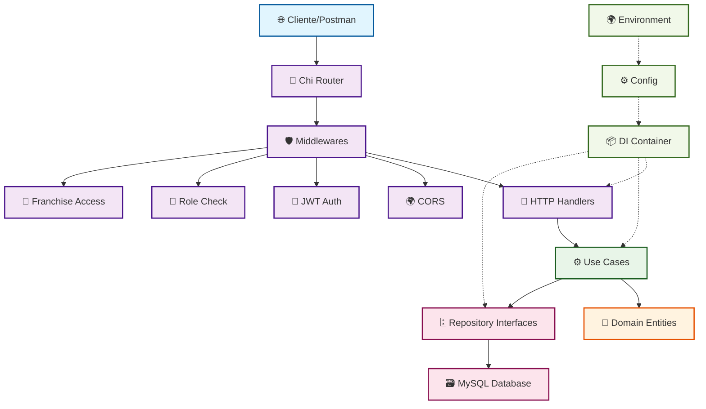
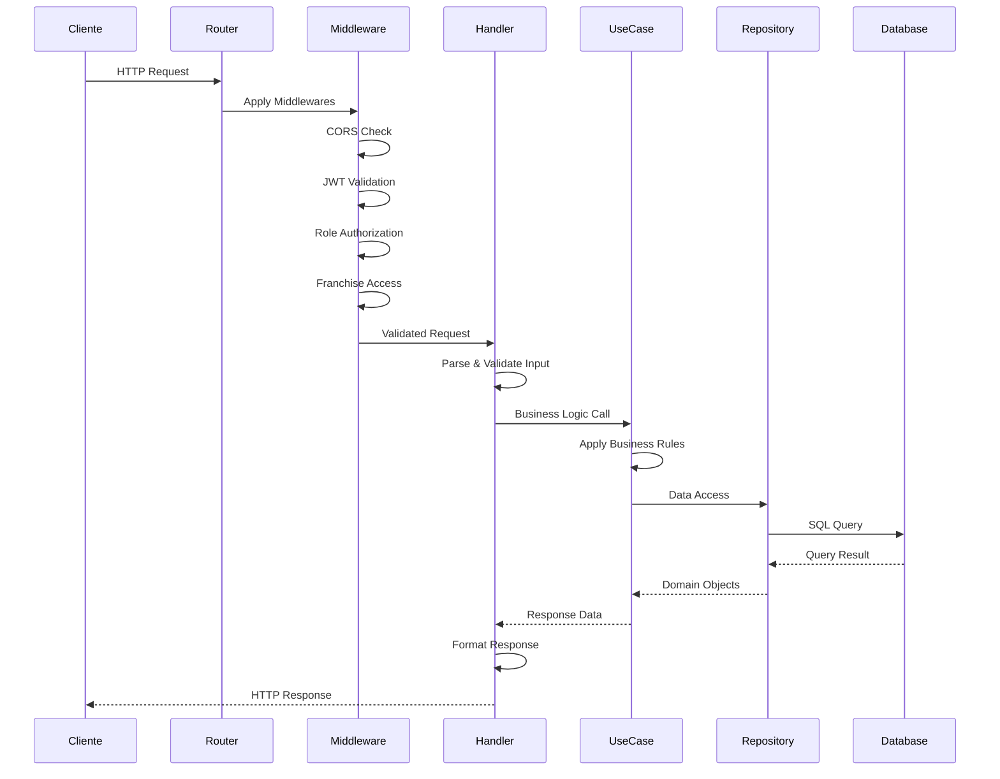
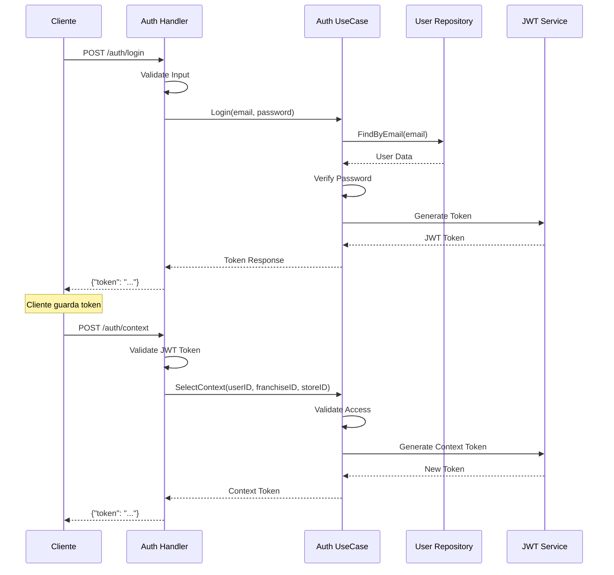
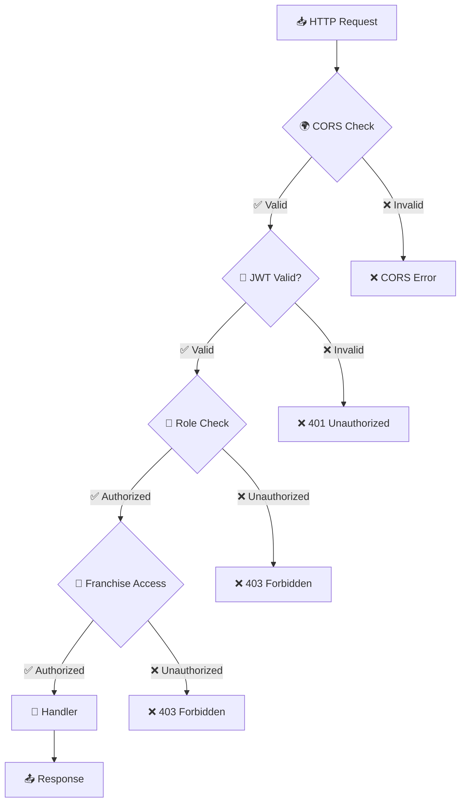
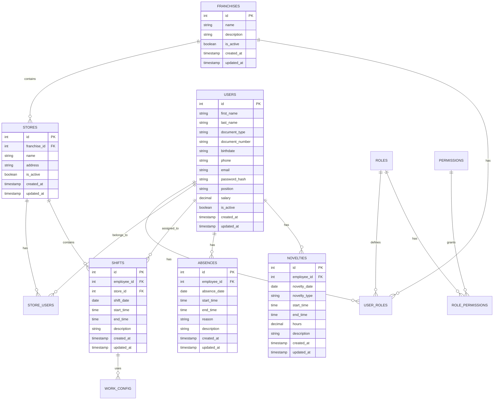

# 🏗️ Arquitectura del Sistema - Loopi API

## 📋 Tabla de Contenido

1. [Visión General](#-visión-general)
2. [Diagrama de Arquitectura](#-diagrama-de-arquitectura)
3. [Capas de la Aplicación](#-capas-de-la-aplicación)
4. [Patrones de Diseño](#-patrones-de-diseño)
5. [Flujo de Datos](#-flujo-de-datos)
6. [Componentes del Sistema](#-componentes-del-sistema)
7. [Middleware y Seguridad](#-middleware-y-seguridad)
8. [Base de Datos](#-base-de-datos)
9. [Configuración y Ambiente](#-configuración-y-ambiente)

## 🌐 Visión General

Loopi API es un sistema de gestión de turnos, empleados y franquicias desarrollado en **Go** utilizando **Clean Architecture** (Arquitectura Hexagonal). El sistema está diseñado para ser escalable, mantenible y testeable, siguiendo los principios SOLID y separación de responsabilidades.

### Características Principales

- **API REST** con endpoints organizados por dominio
- **Autenticación JWT** con manejo de roles y contextos
- **Multi-tenant** con soporte para franquicias y tiendas
- **Gestión completa** de turnos, empleados, ausencias y novedades
- **Sistema de calendario** con manejo de feriados
- **Proyección de turnos** y análisis de horas

## 🏛️ Diagrama de Arquitectura

### Arquitectura General del Sistema



### Diagrama de Componentes Detallado

```mermaid
graph TB
    subgraph "🌐 External"
        PostmanClient[📬 Postman Collections]
        WebClient[🌐 Web Client]
        MobileApp[📱 Mobile App]
    end

    subgraph "📡 Presentation Layer"
        ChiRouter[🔀 Chi Router]

        subgraph "🛡️ Middlewares"
            CORSMw[🌍 CORS]
            JWTMw[🔐 JWT Verification]
            RoleMw[👥 Role Authorization]
            FranchiseMw[🏢 Franchise Access]
            ContextMw[📋 Context Helpers]
        end

        subgraph "📡 HTTP Handlers"
            AuthHandler[🔐 Auth Handler]
            FranchiseHandler[🏢 Franchise Handler]
            StoreHandler[🏪 Store Handler]
            EmployeeHandler[👥 Employee Handler]
            ShiftHandler[🔄 Shift Handler]
            CalendarHandler[📅 Calendar Handler]
            AbsenceHandler[🚫 Absence Handler]
            NoveltyHandler[🎯 Novelty Handler]
        end
    end

    subgraph "⚙️ Application Layer"
        subgraph "📋 Use Cases"
            AuthUC[🔐 Auth UseCase]
            FranchiseUC[🏢 Franchise UseCase]
            StoreUC[🏪 Store UseCase]
            EmployeeUC[👥 Employee UseCase]
            ShiftUC[🔄 Shift UseCase]
            CalendarUC[📅 Calendar UseCase]
            AbsenceUC[🚫 Absence UseCase]
            NoveltyUC[🎯 Novelty UseCase]
            EmployeeHoursUC[⏰ Employee Hours UseCase]
            ShiftProjectionUC[📊 Shift Projection UseCase]
        end

        subgraph "📐 Business Logic"
            Validator[✅ Validator]
            ErrorHandler[❌ Error Handler]
            Logger[📝 Logger]
            BusinessRules[📏 Business Rules]
        end
    end

    subgraph "🏢 Domain Layer"
        subgraph "🎯 Domain Entities"
            User[👤 User]
            Franchise[🏢 Franchise]
            Store[🏪 Store]
            Shift[🔄 Shift]
            Absence[🚫 Absence]
            Novelty[🎯 Novelty]
            Role[👥 Role]
            Permission[🔑 Permission]
        end

        subgraph "📏 Domain Rules"
            BaseEntity[📄 Base Entity]
            DomainErrors[❌ Domain Errors]
        end
    end

    subgraph "🗄️ Infrastructure Layer"
        subgraph "📊 Repository Interfaces"
            UserRepo[👤 User Repository]
            FranchiseRepo[🏢 Franchise Repository]
            StoreRepo[🏪 Store Repository]
            ShiftRepo[🔄 Shift Repository]
            AbsenceRepo[🚫 Absence Repository]
            NoveltyRepo[🎯 Novelty Repository]
            WorkConfigRepo[⚙️ Work Config Repository]
        end

        subgraph "🗃️ Database Implementation"
            MySQLUser[👤 MySQL User Repo]
            MySQLFranchise[🏢 MySQL Franchise Repo]
            MySQLStore[🏪 MySQL Store Repo]
            MySQLShift[🔄 MySQL Shift Repo]
            MySQLAbsence[🚫 MySQL Absence Repo]
            MySQLNovelty[🎯 MySQL Novelty Repo]
            MySQLWorkConfig[⚙️ MySQL WorkConfig Repo]
        end

        subgraph "🗃️ Data Storage"
            MySQL[(🗃️ MySQL Database)]
            Cache[⚡ Cache Layer]
        end
    end

    subgraph "📦 Configuration & DI"
        DIContainer[📦 DI Container]
        Config[⚙️ Configuration]
        Environment[🌍 Environment Variables]
        JWTConfig[🔐 JWT Configuration]
    end

    %% External to Presentation
    PostmanClient --> ChiRouter
    WebClient --> ChiRouter
    MobileApp --> ChiRouter

    %% Presentation Layer Flow
    ChiRouter --> CORSMw
    CORSMw --> JWTMw
    JWTMw --> RoleMw
    RoleMw --> FranchiseMw
    FranchiseMw --> AuthHandler
    FranchiseMw --> FranchiseHandler
    FranchiseMw --> StoreHandler
    FranchiseMw --> EmployeeHandler
    FranchiseMw --> ShiftHandler
    FranchiseMw --> CalendarHandler
    FranchiseMw --> AbsenceHandler
    FranchiseMw --> NoveltyHandler

    %% Handlers to Use Cases
    AuthHandler --> AuthUC
    FranchiseHandler --> FranchiseUC
    StoreHandler --> StoreUC
    EmployeeHandler --> EmployeeUC
    EmployeeHandler --> EmployeeHoursUC
    ShiftHandler --> ShiftUC
    ShiftHandler --> ShiftProjectionUC
    CalendarHandler --> CalendarUC
    AbsenceHandler --> AbsenceUC
    NoveltyHandler --> NoveltyUC

    %% Use Cases to Domain
    AuthUC --> User
    FranchiseUC --> Franchise
    StoreUC --> Store
    EmployeeUC --> User
    EmployeeUC --> Role
    ShiftUC --> Shift
    AbsenceUC --> Absence
    NoveltyUC --> Novelty

    %% Use Cases to Business Logic
    AuthUC --> Validator
    FranchiseUC --> BusinessRules
    StoreUC --> ErrorHandler
    EmployeeUC --> Logger

    %% Use Cases to Repositories
    AuthUC --> UserRepo
    FranchiseUC --> FranchiseRepo
    StoreUC --> StoreRepo
    EmployeeUC --> UserRepo
    EmployeeHoursUC --> UserRepo
    EmployeeHoursUC --> AbsenceRepo
    EmployeeHoursUC --> NoveltyRepo
    ShiftUC --> ShiftRepo
    ShiftProjectionUC --> ShiftRepo
    ShiftProjectionUC --> WorkConfigRepo
    AbsenceUC --> AbsenceRepo
    NoveltyUC --> NoveltyRepo

    %% Repository Interfaces to Implementations
    UserRepo --> MySQLUser
    FranchiseRepo --> MySQLFranchise
    StoreRepo --> MySQLStore
    ShiftRepo --> MySQLShift
    AbsenceRepo --> MySQLAbsence
    NoveltyRepo --> MySQLNovelty
    WorkConfigRepo --> MySQLWorkConfig

    %% Implementations to Database
    MySQLUser --> MySQL
    MySQLFranchise --> MySQL
    MySQLStore --> MySQL
    MySQLShift --> MySQL
    MySQLAbsence --> MySQL
    MySQLNovelty --> MySQL
    MySQLWorkConfig --> MySQL

    %% Cache
    CalendarUC --> Cache

    %% Dependency Injection
    DIContainer -.-> AuthHandler
    DIContainer -.-> FranchiseHandler
    DIContainer -.-> StoreHandler
    DIContainer -.-> EmployeeHandler
    DIContainer -.-> ShiftHandler
    DIContainer -.-> CalendarHandler
    DIContainer -.-> AbsenceHandler
    DIContainer -.-> NoveltyHandler

    DIContainer -.-> AuthUC
    DIContainer -.-> FranchiseUC
    DIContainer -.-> StoreUC
    DIContainer -.-> EmployeeUC
    DIContainer -.-> EmployeeHoursUC
    DIContainer -.-> ShiftUC
    DIContainer -.-> ShiftProjectionUC
    DIContainer -.-> CalendarUC
    DIContainer -.-> AbsenceUC
    DIContainer -.-> NoveltyUC

    DIContainer -.-> MySQLUser
    DIContainer -.-> MySQLFranchise
    DIContainer -.-> MySQLStore
    DIContainer -.-> MySQLShift
    DIContainer -.-> MySQLAbsence
    DIContainer -.-> MySQLNovelty
    DIContainer -.-> MySQLWorkConfig

    %% Configuration
    Config --> DIContainer
    Environment --> Config
    JWTConfig --> JWTMw
    Config --> MySQL

    %% Styling
    classDef external fill:#e1f5fe,stroke:#01579b,stroke-width:2px
    classDef presentation fill:#f3e5f5,stroke:#4a148c,stroke-width:2px
    classDef application fill:#e8f5e8,stroke:#1b5e20,stroke-width:2px
    classDef domain fill:#fff3e0,stroke:#e65100,stroke-width:2px
    classDef infrastructure fill:#fce4ec,stroke:#880e4f,stroke-width:2px
    classDef config fill:#f1f8e9,stroke:#33691e,stroke-width:2px
```



## 🏗️ Capas de la Aplicación

### 1. 🌐 External Layer (Cliente)

- **Postman Collections**: Testing automatizado de endpoints
- **Web Clients**: Aplicaciones frontend
- **Mobile Apps**: Aplicaciones móviles

### 2. 📡 Presentation Layer (Interfaz)

- **Chi Router**: Enrutamiento HTTP con middleware support
- **HTTP Handlers**: Controladores REST específicos por dominio
- **Middlewares**: CORS, JWT, autorización, validación de contexto

### 3. ⚙️ Application Layer (Aplicación)

- **Use Cases**: Lógica de negocio y orquestación
- **Business Rules**: Reglas de negocio específicas
- **Validators**: Validación de datos de entrada
- **Error Handlers**: Manejo centralizado de errores

### 4. 🏢 Domain Layer (Dominio)

- **Entities**: Modelos de dominio puros
- **Base Models**: Entidades base con campos comunes
- **Domain Errors**: Errores específicos del dominio

### 5. 🗄️ Infrastructure Layer (Infraestructura)

- **Repository Interfaces**: Contratos de acceso a datos
- **MySQL Repositories**: Implementaciones concretas con GORM
- **Database**: Base de datos MySQL
- **Cache**: Sistema de caché para optimización

### 6. 📦 Configuration & DI

- **Container**: Sistema de inyección de dependencias
- **Configuration**: Gestión de configuración
- **Environment**: Variables de entorno

## 🎯 Patrones de Diseño

### 1. **Clean Architecture / Hexagonal Architecture**

- Separación clara de responsabilidades
- Independencia de frameworks y base de datos
- Facilita testing y mantenibilidad

### 2. **Dependency Injection**

```go
type Container struct {
    DB           *gorm.DB
    Repositories *Repositories
    UseCases     *UseCases
    Handlers     *Handlers
}
```

### 3. **Repository Pattern**

```go
type UserRepository interface {
    Create(user *domain.User) error
    FindByID(id int) (*domain.User, error)
    FindByEmail(email string) (*domain.User, error)
    Update(user *domain.User) error
    Delete(id int) error
}
```

### 4. **Factory Pattern**

- `newRepositories()`: Creación de repositorios
- `newUseCases()`: Creación de casos de uso
- `newHandlers()`: Creación de handlers

### 5. **Middleware Pattern**

```go
func JWTMiddleware(next http.Handler) http.Handler
func RequireRoles(roles ...string) func(http.Handler) http.Handler
func RequireFranchiseAccess() func(http.Handler) http.Handler
```

## 🔄 Flujo de Datos

### Flujo de Request Normal



### Flujo de Autenticación



## 🧩 Componentes del Sistema

### Módulos de Negocio

| Módulo             | Responsabilidad            | Entidades Principales  |
| ------------------ | -------------------------- | ---------------------- |
| **Authentication** | Login, contexto, JWT       | User, Role, Permission |
| **Franchises**     | Gestión de franquicias     | Franchise              |
| **Stores**         | Gestión de tiendas         | Store, StoreUser       |
| **Employees**      | Gestión de empleados       | User, UserRole         |
| **Shifts**         | Turnos de trabajo          | Shift, AssignedShift   |
| **Calendar**       | Feriados y días laborables | Holiday (external API) |
| **Absences**       | Ausencias laborales        | Absence                |
| **Novelties**      | Horas extra, bonos         | Novelty                |
| **Employee Hours** | Cálculo de horas           | Summary (computed)     |
| **Shift Planning** | Proyección de turnos       | Projection (computed)  |

### Componentes Transversales

#### 🛡️ Security Components

- **JWT Middleware**: Validación de tokens
- **Role Middleware**: Autorización basada en roles
- **Franchise Middleware**: Control de acceso multi-tenant
- **CORS Middleware**: Cross-origin resource sharing

#### 📋 Utility Components

- **Context Helpers**: Extracción de datos del contexto
- **Error Handlers**: Manejo estandarizado de errores
- **Validators**: Validación de datos de entrada
- **Logger**: Sistema de logging centralizado

## 🔐 Middleware y Seguridad

### Stack de Middleware

```go
// Orden de aplicación de middlewares
r.Use(middleware.CORS)                    // 1. CORS
r.Use(middleware.JWTMiddleware)           // 2. JWT Validation
r.Use(middleware.RequireRoles("admin"))   // 3. Role Check
r.Use(middleware.RequireFranchiseAccess()) // 4. Franchise Access
```

### Niveles de Seguridad

1. **Público**: Solo `/auth/login`
2. **Autenticado**: Requiere JWT válido
3. **Roles Específicos**: Requiere rol `admin`
4. **Contexto de Franquicia**: Acceso limitado por franquicia

### Flujo de Autorización



## 🗃️ Base de Datos

### Modelo de Datos



### Estrategias de Datos

#### 🔍 Repository Pattern Implementation

```go
// Interface (Domain Layer)
type UserRepository interface {
    Create(user *domain.User) error
    FindByID(id int) (*domain.User, error)
    FindByEmail(email string) (*domain.User, error)
    GetByStore(storeID int) ([]domain.User, error)
    Update(user *domain.User) error
    Delete(id int) error
}

// Implementation (Infrastructure Layer)
type mysqlUserRepository struct {
    db *gorm.DB
}
```

#### 📊 Data Access Patterns

- **GORM ORM**: Para operaciones CRUD estándar
- **Raw Queries**: Para consultas complejas de reporting
- **Transactions**: Para operaciones atómicas
- **Soft Deletes**: Para mantener integridad histórica

## ⚙️ Configuración y Ambiente

### Variables de Entorno

```bash
# Database
DB_HOST=localhost
DB_PORT=3306
DB_USER=root
DB_PASSWORD=password
DB_NAME=loopi_db

# JWT
JWT_SECRET=your-secret-key
JWT_EXPIRATION=24h

# Server
PORT=8080
ENVIRONMENT=development

# External APIs
HOLIDAY_API_URL=https://api.holidays.com
```

### Configuración por Ambiente

| Variable         | Development | Production          | Testing |
| ---------------- | ----------- | ------------------- | ------- |
| `DB_HOST`        | localhost   | prod-db.company.com | test-db |
| `JWT_EXPIRATION` | 24h         | 2h                  | 1h      |
| `LOG_LEVEL`      | debug       | info                | debug   |
| `ENVIRONMENT`    | development | production          | testing |

### Inicialización de la Aplicación

```go
// 1. Load Environment
godotenv.Load()
config.LoadSecrets()

// 2. Initialize Database
db := gorm.Open(mysql.Open(config.GetDB()))

// 3. Create Container (DI)
container := container.NewContainer(db)

// 4. Setup Routes
router := router.SetupRoutes(container)

// 5. Start Server
http.ListenAndServe(":"+port, router)
```

---

## 📚 Referencias y Documentación

- **Clean Architecture**: [Uncle Bob's Clean Architecture](https://blog.cleancoder.com/uncle-bob/2012/08/13/the-clean-architecture.html)
- **Go Project Layout**: [Standard Go Project Layout](https://github.com/golang-standards/project-layout)
- **Chi Router**: [go-chi/chi Documentation](https://github.com/go-chi/chi)
- **GORM**: [GORM Documentation](https://gorm.io/docs/)
- **JWT**: [JWT.io](https://jwt.io/)

---

> 📝 **Nota**: Esta arquitectura está diseñada para ser escalable y mantenible. Cada capa tiene responsabilidades bien definidas y las dependencias fluyen hacia adentro, permitiendo fácil testing y modificación de componentes individuales sin afectar el resto del sistema.
