# 🚀 Diagrama de Deployment - Loopi API

## 📦 Arquitectura de Deployment

### Diagrama de Infraestructura

```mermaid
graph TB
    subgraph "🌐 Cliente Layer"
        Browser[🌐 Web Browser]
        Mobile[📱 Mobile App]
        Postman[📬 Postman]
    end

    subgraph "🔄 Load Balancer / Reverse Proxy"
        Nginx[🔧 Nginx / Apache]
        LB[⚖️ Load Balancer]
    end

    subgraph "🏠 Application Server Environment"
        subgraph "🐳 Container/VM 1"
            App1[🚀 Loopi API Instance 1]
            Port1[:8080]
        end

        subgraph "🐳 Container/VM 2"
            App2[🚀 Loopi API Instance 2]
            Port2[:8080]
        end

        subgraph "🐳 Container/VM N"
            AppN[🚀 Loopi API Instance N]
            PortN[:8080]
        end
    end

    subgraph "🗄️ Data Layer"
        subgraph "🗃️ Database Cluster"
            DBMaster[(🗃️ MySQL Master)]
            DBSlave1[(🗃️ MySQL Slave 1)]
            DBSlave2[(🗃️ MySQL Slave 2)]
        end

        subgraph "⚡ Cache Layer"
            Redis[(⚡ Redis Cache)]
            Memcached[(⚡ Memcached)]
        end

        subgraph "📁 File Storage"
            FileSystem[📁 Local/NFS Storage]
            S3[☁️ AWS S3 / Cloud Storage]
        end
    end

    subgraph "🔍 Monitoring & Logging"
        Prometheus[📊 Prometheus]
        Grafana[📈 Grafana]
        ELK[📝 ELK Stack]
        Jaeger[🔍 Jaeger Tracing]
    end

    subgraph "🔐 Security & Config"
        Vault[🔐 HashiCorp Vault]
        Consul[⚙️ Consul Config]
        Firewall[🛡️ Firewall]
    end

    %% Client to Load Balancer
    Browser --> LB
    Mobile --> LB
    Postman --> LB

    %% Load Balancer to Nginx
    LB --> Nginx
    Nginx --> App1
    Nginx --> App2
    Nginx --> AppN

    %% Application to Database
    App1 --> DBMaster
    App1 --> DBSlave1
    App2 --> DBMaster
    App2 --> DBSlave2
    AppN --> DBMaster
    AppN --> DBSlave1

    %% Database Replication
    DBMaster -.-> DBSlave1
    DBMaster -.-> DBSlave2

    %% Application to Cache
    App1 --> Redis
    App2 --> Redis
    AppN --> Memcached

    %% Application to File Storage
    App1 --> FileSystem
    App2 --> S3
    AppN --> FileSystem

    %% Monitoring
    App1 --> Prometheus
    App2 --> Prometheus
    AppN --> Prometheus
    Prometheus --> Grafana

    App1 --> ELK
    App2 --> ELK
    AppN --> ELK

    App1 --> Jaeger
    App2 --> Jaeger
    AppN --> Jaeger

    %% Security & Config
    App1 --> Vault
    App2 --> Vault
    AppN --> Vault

    App1 --> Consul
    App2 --> Consul
    AppN --> Consul

    Firewall -.-> App1
    Firewall -.-> App2
    Firewall -.-> AppN

    %% Styling
    classDef client fill:#e1f5fe,stroke:#01579b,stroke-width:2px
    classDef proxy fill:#f3e5f5,stroke:#4a148c,stroke-width:2px
    classDef app fill:#e8f5e8,stroke:#1b5e20,stroke-width:2px
    classDef data fill:#fce4ec,stroke:#880e4f,stroke-width:2px
    classDef monitoring fill:#fff3e0,stroke:#e65100,stroke-width:2px
    classDef security fill:#f1f8e9,stroke:#33691e,stroke-width:2px

    class Browser,Mobile,Postman client
    class Nginx,LB proxy
    class App1,App2,AppN,Port1,Port2,PortN app
    class DBMaster,DBSlave1,DBSlave2,Redis,Memcached,FileSystem,S3 data
    class Prometheus,Grafana,ELK,Jaeger monitoring
    class Vault,Consul,Firewall security
```



## 🐳 Docker Deployment

### Dockerfile

```dockerfile
# Build stage
FROM golang:1.19-alpine AS builder

WORKDIR /app
COPY go.mod go.sum ./
RUN go mod download

COPY . .
RUN CGO_ENABLED=0 GOOS=linux go build -o loopi-api cmd/server/main.go

# Runtime stage
FROM alpine:latest

RUN apk --no-cache add ca-certificates tzdata
WORKDIR /root/

COPY --from=builder /app/loopi-api .
COPY --from=builder /app/.env .

EXPOSE 8080

CMD ["./loopi-api"]
```

### Docker Compose

```yaml
version: "3.8"

services:
  loopi-api:
    build: .
    ports:
      - "8080:8080"
    environment:
      - DB_HOST=mysql
      - DB_PORT=3306
      - DB_USER=root
      - DB_PASSWORD=rootpassword
      - DB_NAME=loopi_db
      - JWT_SECRET=your-secret-key
    depends_on:
      - mysql
      - redis
    networks:
      - loopi-network

  mysql:
    image: mysql:8.0
    environment:
      - MYSQL_ROOT_PASSWORD=rootpassword
      - MYSQL_DATABASE=loopi_db
    ports:
      - "3306:3306"
    volumes:
      - mysql_data:/var/lib/mysql
      - ./scripts/tables:/docker-entrypoint-initdb.d
    networks:
      - loopi-network

  redis:
    image: redis:alpine
    ports:
      - "6379:6379"
    networks:
      - loopi-network

  nginx:
    image: nginx:alpine
    ports:
      - "80:80"
      - "443:443"
    volumes:
      - ./nginx.conf:/etc/nginx/nginx.conf
    depends_on:
      - loopi-api
    networks:
      - loopi-network

volumes:
  mysql_data:

networks:
  loopi-network:
    driver: bridge
```

## ☸️ Kubernetes Deployment

### Namespace

```yaml
apiVersion: v1
kind: Namespace
metadata:
  name: loopi-api
```

### ConfigMap

```yaml
apiVersion: v1
kind: ConfigMap
metadata:
  name: loopi-config
  namespace: loopi-api
data:
  DB_HOST: "mysql-service"
  DB_PORT: "3306"
  DB_NAME: "loopi_db"
  PORT: "8080"
  ENVIRONMENT: "production"
```

### Secret

```yaml
apiVersion: v1
kind: Secret
metadata:
  name: loopi-secrets
  namespace: loopi-api
type: Opaque
data:
  DB_USER: cm9vdA== # base64 encoded 'root'
  DB_PASSWORD: cm9vdHBhc3N3b3Jk # base64 encoded 'rootpassword'
  JWT_SECRET: eW91ci1zZWNyZXQta2V5 # base64 encoded 'your-secret-key'
```

### Deployment

```yaml
apiVersion: apps/v1
kind: Deployment
metadata:
  name: loopi-api
  namespace: loopi-api
spec:
  replicas: 3
  selector:
    matchLabels:
      app: loopi-api
  template:
    metadata:
      labels:
        app: loopi-api
    spec:
      containers:
        - name: loopi-api
          image: loopi-api:latest
          ports:
            - containerPort: 8080
          envFrom:
            - configMapRef:
                name: loopi-config
            - secretRef:
                name: loopi-secrets
          livenessProbe:
            httpGet:
              path: /health
              port: 8080
            initialDelaySeconds: 30
            periodSeconds: 10
          readinessProbe:
            httpGet:
              path: /ready
              port: 8080
            initialDelaySeconds: 5
            periodSeconds: 5
          resources:
            requests:
              memory: "128Mi"
              cpu: "100m"
            limits:
              memory: "512Mi"
              cpu: "500m"
```

### Service

```yaml
apiVersion: v1
kind: Service
metadata:
  name: loopi-api-service
  namespace: loopi-api
spec:
  selector:
    app: loopi-api
  ports:
    - protocol: TCP
      port: 80
      targetPort: 8080
  type: ClusterIP
```

### Ingress

```yaml
apiVersion: networking.k8s.io/v1
kind: Ingress
metadata:
  name: loopi-api-ingress
  namespace: loopi-api
  annotations:
    kubernetes.io/ingress.class: nginx
    cert-manager.io/cluster-issuer: letsencrypt-prod
spec:
  tls:
    - hosts:
        - api.loopi.com
      secretName: loopi-api-tls
  rules:
    - host: api.loopi.com
      http:
        paths:
          - path: /
            pathType: Prefix
            backend:
              service:
                name: loopi-api-service
                port:
                  number: 80
```

## 🔧 Configuración de Nginx

```nginx
upstream loopi_backend {
    server loopi-api-1:8080 weight=1 max_fails=3 fail_timeout=30s;
    server loopi-api-2:8080 weight=1 max_fails=3 fail_timeout=30s;
    server loopi-api-3:8080 weight=1 max_fails=3 fail_timeout=30s;
}

server {
    listen 80;
    server_name api.loopi.com;

    # Redirect HTTP to HTTPS
    return 301 https://$server_name$request_uri;
}

server {
    listen 443 ssl http2;
    server_name api.loopi.com;

    # SSL Configuration
    ssl_certificate /etc/ssl/certs/loopi.crt;
    ssl_certificate_key /etc/ssl/private/loopi.key;
    ssl_protocols TLSv1.2 TLSv1.3;
    ssl_ciphers HIGH:!aNULL:!MD5;

    # Security Headers
    add_header X-Frame-Options DENY;
    add_header X-Content-Type-Options nosniff;
    add_header X-XSS-Protection "1; mode=block";
    add_header Strict-Transport-Security "max-age=31536000; includeSubDomains" always;

    # Gzip Compression
    gzip on;
    gzip_vary on;
    gzip_min_length 1024;
    gzip_types text/plain application/json application/javascript text/css;

    # Rate Limiting
    limit_req_zone $binary_remote_addr zone=api:10m rate=10r/s;
    limit_req zone=api burst=20 nodelay;

    # Proxy Configuration
    location / {
        proxy_pass http://loopi_backend;
        proxy_set_header Host $host;
        proxy_set_header X-Real-IP $remote_addr;
        proxy_set_header X-Forwarded-For $proxy_add_x_forwarded_for;
        proxy_set_header X-Forwarded-Proto $scheme;

        # Timeouts
        proxy_connect_timeout 5s;
        proxy_send_timeout 60s;
        proxy_read_timeout 60s;

        # Health Check
        proxy_next_upstream error timeout invalid_header http_500 http_502 http_503;
    }

    # Health Check Endpoint
    location /health {
        proxy_pass http://loopi_backend/health;
        access_log off;
    }

    # Static Assets (if any)
    location /static/ {
        alias /var/www/static/;
        expires 1y;
        add_header Cache-Control "public, immutable";
    }
}
```

## 📊 Monitoring Stack

### Prometheus Configuration

```yaml
global:
  scrape_interval: 15s
  evaluation_interval: 15s

rule_files:
  - "loopi_rules.yml"

scrape_configs:
  - job_name: "loopi-api"
    static_configs:
      - targets: ["loopi-api-1:8080", "loopi-api-2:8080", "loopi-api-3:8080"]
    metrics_path: /metrics
    scrape_interval: 5s

  - job_name: "mysql"
    static_configs:
      - targets: ["mysql-exporter:9104"]

  - job_name: "redis"
    static_configs:
      - targets: ["redis-exporter:9121"]
```

### Grafana Dashboard

```json
{
  "dashboard": {
    "title": "Loopi API Metrics",
    "panels": [
      {
        "title": "Request Rate",
        "type": "graph",
        "targets": [
          {
            "expr": "rate(http_requests_total[5m])",
            "legendFormat": "{{method}} {{endpoint}}"
          }
        ]
      },
      {
        "title": "Response Time",
        "type": "graph",
        "targets": [
          {
            "expr": "histogram_quantile(0.95, rate(http_request_duration_seconds_bucket[5m]))",
            "legendFormat": "95th percentile"
          }
        ]
      },
      {
        "title": "Error Rate",
        "type": "graph",
        "targets": [
          {
            "expr": "rate(http_requests_total{status=~\"4..|5..\"}[5m])",
            "legendFormat": "Error Rate"
          }
        ]
      }
    ]
  }
}
```

## 🚀 CI/CD Pipeline

### GitHub Actions

```yaml
name: CI/CD Pipeline

on:
  push:
    branches: [main, develop]
  pull_request:
    branches: [main]

jobs:
  test:
    runs-on: ubuntu-latest
    steps:
      - uses: actions/checkout@v3

      - name: Set up Go
        uses: actions/setup-go@v3
        with:
          go-version: 1.19

      - name: Run tests
        run: go test -v ./...

      - name: Run linting
        run: golangci-lint run

  build-and-deploy:
    needs: test
    runs-on: ubuntu-latest
    if: github.ref == 'refs/heads/main'

    steps:
      - uses: actions/checkout@v3

      - name: Build Docker image
        run: docker build -t loopi-api:${{ github.sha }} .

      - name: Push to registry
        run: |
          docker tag loopi-api:${{ github.sha }} ${{ secrets.DOCKER_REGISTRY }}/loopi-api:${{ github.sha }}
          docker push ${{ secrets.DOCKER_REGISTRY }}/loopi-api:${{ github.sha }}

      - name: Deploy to Kubernetes
        run: |
          kubectl set image deployment/loopi-api loopi-api=${{ secrets.DOCKER_REGISTRY }}/loopi-api:${{ github.sha }}
          kubectl rollout status deployment/loopi-api
```

## 🔐 Security Considerations

### Network Security

- **Firewall Rules**: Solo puertos necesarios expuestos
- **VPN Access**: Acceso administrativo mediante VPN
- **Network Segmentation**: Separación de capas en diferentes subnets

### Application Security

- **JWT Tokens**: Autenticación estateless
- **HTTPS Only**: TLS 1.2+ requerido
- **Rate Limiting**: Protección contra ataques DDoS
- **Input Validation**: Validación estricta de inputs

### Data Security

- **Encryption at Rest**: Base de datos encriptada
- **Encryption in Transit**: TLS para todas las comunicaciones
- **Secrets Management**: HashiCorp Vault o AWS Secrets Manager
- **Database Access**: Conexiones encriptadas con certificados

---

> 📝 **Nota**: Esta configuración de deployment está diseñada para un ambiente de producción escalable y seguro. Ajusta los recursos, replicas y configuraciones según tus necesidades específicas.
